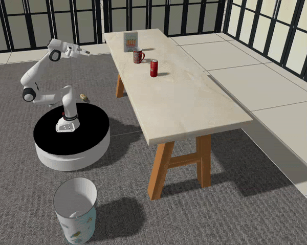

# Embodied-RobotSim: LLM-Driven Embodied Intelligence & Mobile Manipulation Simulation

[](https://docs.ros.org/en/jazzy/index.html)
[](README.md)

Embodied-RobotSim is a comprehensive ROS 2 (Jazzy) simulation workspace for a differential-drive mobile robot equipped with a **Franka FR3 robotic arm**, a 2D LiDAR, a stereo RGB-D camera, and a rich, advanced sensor suite. The system is deeply optimized for **low hardware requirements** and high efficiency, integrating leading-edge algorithms for mapping, navigation, advanced visual perception, mobile manipulation, and a **Qwen3 LLM-driven embodied intelligence closed-loop**, enabling complex robotic interactions via natural language instructions and a Web UI dashboard.

## 🎬 Demos

### 1. Large Language Model Embodied Closed-Loop (LLM Agent)


*Multi-modal interaction loop via Qwen3 and VLM*

### 2. Autonomous Mobile Grasping (Pick & Place)


*Autonomous Grasping via YOLOE & GraspNet*

### 3. Simulation Environment (Gazebo Sim)


*Indoor Scene Simulation with Nav2 Autonomous Navigation and OctoMap 3D Mapping*

## 🌟 Key Features

* **Mobile Manipulation:** Integration of MoveIt 2 for the Franka FR3 arm with a differential-drive mobile base controller.
* **Autonomous Exploration & Mapping:** High-precision SLAM with Cartographer (native 2D LiDAR + IMU fusion) and frontier-based autonomous exploration using `m-explore-ros2`.
* **Advanced Perception (Vision):**
  * **YOLOE Inference:** Real-time object detection with text prompts (`yoloe_infer`).
* **Semantic Occupancy & Grasping:**
  * Generates semantic occupancy mapping using OctoMap.
  * **Autonomous Grasping Integration:** Combines **YOLOE** (target localization) and **GraspNet** (pose estimation) to produce 6-DoF grasp poses from point clouds for arbitrary objects, with complex collision avoidance at both point cloud and OctoMap levels.
* **Embodied Intelligence & Multi-modal LLM Interaction:**
  * **Qwen3 LLM Engine:** Integrates the Qwen3 large language model, capable of parsing natural language instructions into robotic task sequences (navigation, grasping, etc.).
  * **Scene Pre-recognition:** Utilizes Vision-Language Models (VLM) to automatically "look at" the current environment before executing tasks, dynamically adjusting and planning subsequent operations.
  * **WebSocket-based Full-featured Web UI:** Provides an intuitive and beautiful browser-based control dashboard (including maps, camera streams, teleop joystick, status display, and an AI chat sidebar), completely eliminating the need for complex terminal operations.

## 📦 Architecture Overview

### ROS 2 Packages

| Package | Purpose |
|---------|---------|
| `x_bot` | Main robot package: URDF, Gazebo worlds, launch files, nav configs, and the `robot_actions` MoveIt arm controller. |
| `yoloe_infer` | TensorRT-based YOLOE object detection with text prompts. |
| `graspnet_infer` | TensorRT-based GraspNet integration for 6-DoF grasp pose generation from point clouds. |
| `m-explore-ros2` | `explore_lite` package adapted for ROS 2 to perform autonomous frontier-based exploration. |
| `franka_description` | Franka FR3 arm URDF and robot meshes. |
| `franka_ros2` | MoveIt 2 configs for the FR3 arm (`franka_fr3_moveit_config`). |

## 🛠️ System Requirements

To ensure the simulation system runs correctly, please deploy in the following environment:

| Dependency | Recommended Version |
|---------|---------|
| **Operating System** | [Ubuntu 24.04 (Noble)](https://ubuntu.com/download/desktop) |
| **ROS 2** | [Jazzy Jalisco](https://docs.ros.org/en/jazzy/installation.html) ([One-click Install](https://fishros.org.cn/forum/topic/20)) |
| **Gazebo** | [Harmonic (Gz Sim 8)](https://gazebosim.org/docs/harmonic/install) |
| **CUDA** | [13.1](https://developer.nvidia.com/cuda-toolkit) |
| **TensorRT** | [10.14.1.48](https://developer.nvidia.com/tensorrt) |
| **Python** | 3.12+ |

> **💻 Tested Hardware Reference**
>
> This project runs smoothly on the following mid-range consumer hardware, making it accessible and easy to deploy:
> *   **CPU**: Intel Core i5-13400F
> *   **GPU**: NVIDIA GeForce RTX 4060
> *   **Memory**: 32GB RAM

## 📦 Models Download

Since the model files are quite large, please download the pre-trained weights from the following link and place them in the specified directories:

*   **Download Link**: [Google Drive Folder](https://drive.google.com/drive/folders/1gPPyvKqiYd7cg2vUyqucV1CjLTf6J0y2?usp=drive_link)

| File Name | Placement Path (Relative to Project Root) |
| :--- | :--- |
| `yoloe-v8l-text-prompt-multi_nc10_fp16.engine` | `src/yoloe_infer/models/` |
| `yoloe-v8l-text-prompt-multi_nc10_fp16.onnx` | `src/yoloe_infer/models/` |
| `graspnet.trt` | `src/graspnet_infer/` |
| `graspnet.onnx` | `src/graspnet_infer/` |

## 🚀 Quick Start Instructions

> **IMPORTANT**: Before starting the build process, please ensure you have completed the installation of **ROS 2**, **Gazebo**, **CUDA**, and **TensorRT** as specified in the table above.

### 1. Build the Workspace

```bash
cd ~/robotSim
# 1. Build TensorRT Plugins (required for GraspNet)
bash src/graspnet_infer/tensorrt_plugins/build.sh

# 2. Install dependencies (recommended to use FishRos tool or rosdep)
rosdep install --from-paths src --ignore-src -r -y

# 3. Build all ROS 2 packages
colcon build --symlink-install --cmake-args -DCMAKE_BUILD_TYPE=Release
source install/setup.bash
```

### 2. Run the Demos

We provide three pre-configured one-click bash scripts in the root directory for different workflow modes.

#### Mode 1: Autonomous Exploration & Mapping
Automatically explore unknown environments using `explore_lite`, Cartographer and generated YOLOE/OctoMap:
```bash
./start_explore_mapping.sh
```

#### Mode 2: Static Navigation
Navigate the robot in an already mapped environment using Nav2 and Cartographer localization:
```bash
./start_navigation.sh
```

#### Mode 3: Autonomous Mobile Grasping (Pick and Place)
Spawn the robot in the `manipulation_test` world, start perception pipelines (YOLOE, GraspNet), and execute a semantic pick-and-place loop using MoveIt! (for example: identifying, grabbing, and placing a coke, a book, and a cup):
```bash
./start_pick_and_place_demo.sh
```

#### Mode 4: Large Language Model Embodied Closed-Loop (LLM Agent + Web UI)
This mode launches the full suite of low-level control and perception nodes, mounts the Qwen3 LLM Agent server, and finally opens the Web UI dashboard automatically in your browser. You can directly input natural language commands in the chat sidebar (e.g., "Go to the kitchen to get a coke", "Get a book from the study"), and the system will automatically recognize the scene and plan the execution:
```bash
./start_llm_agent.sh
```

> **Note:** To quickly kill all related simulation and ROS 2 processes, use the helper script:  
> `./stop_robot_sim.sh`

## ⚙️ Key Topics and Services

* **/arm_command/pose** (Topic, `geometry_msgs/msg/PoseStamped`): Move the Franka arm to the desired pose.
* **/robot_actions/go_home** (Service, `std_srvs/srv/Trigger`): Move the arm to its home standby position.
* **/robot_actions/scan** (Service, `std_srvs/srv/Trigger`): Move the arm to its scanning pose for optimal camera coverage.
* **/yoloe_multi_text_prompt/set_cloud_filter** (Topic, `std_msgs/msg/Int32`): Sets the target ID for point cloud filtering based on semantic detections.

## 🤝 Contribution and Customization

* **World Environments:** Modify or add Gazebo worlds inside `src/x_bot/worlds/` (includes `simple_room.sdf`, `ware_house.sdf`, etc.).
* **Navigation Config:** Tune Nav2 and Cartographer parameters in `src/x_bot/config/`.
## 👏 Acknowledgements

This project is built upon the following open-source repositories. We sincerely thank the authors and maintainers for their contributions:

* **[YOLOE](https://github.com/THU-MIG/yoloe):** Robust 2D object detection framework.
* **[GraspNet-Baseline](https://github.com/graspnet/graspnet-baseline):** Foundation for 6-DoF grasp pose estimation.
* **[m-explore-ros2](https://github.com/robo-friends/m-explore-ros2):** Autonomous exploration components for ROS 2.
* **[franka_ros2](https://github.com/frankaemika/franka_ros2) & [franka_description](https://github.com/frankaemika/franka_description):** Official ROS 2 support from Franka Emika.
* **[Cartographer](https://github.com/cartographer-project/cartographer_ros):** Advanced 2D/3D SLAM solution.
* **[bcr_bot](https://github.com/blackcoffeerobotics/bcr_bot):** Reference for differential drive mobile base simulation.
