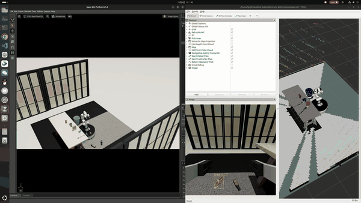
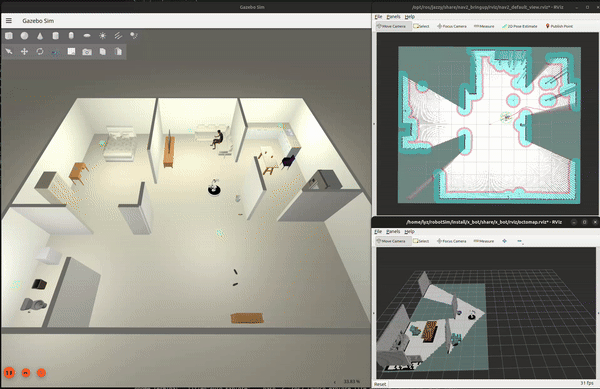
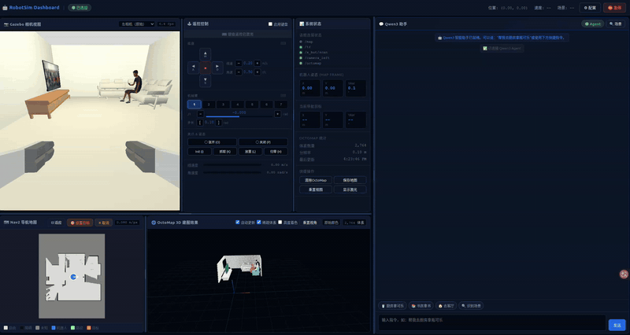

# Embodied-RobotSim

[中文](README.md)

Mobile manipulation simulation with **ROS 2 Jazzy + Isaac Sim 6.1 / Gazebo Harmonic**: FAST-LIO localization/mapping, Nav2 exploration/navigation, YOLOE perception, CUDA semantic voxel mapping, GraspNet and natural-language task execution.

## Demos

### Isaac Sim manipulation



### Gazebo mapping and navigation



### Embodied task loop



## Launch

Run from the repository root. **Isaac Sim is the default**; append `--sim gazebo` or edit `SIM_BACKEND` at the top of the launcher.

| Command | Function | Default world | Additional prerequisite |
|---|---|---|---|
| `./start_mapping_and_explore.sh` | Automatic exploration, FAST-LIO and semantic mapping; save maps on completion | `simple_room` | No existing map needed |
| `./start_mapping_and_explore.sh --mode navigation` | ICP localization and Nav2; set Nav2 Goal in RViz | `simple_room` | Complete map bundle for this world |
| `./start_pick_and_place.sh` | Scan and pick/place book, cup, coke, bottle and shoe | `manipulation_test` | No existing map needed |
| `./start_pick_and_place.sh --mode navigation` | Navigate and execute manipulation tasks | `simple_room` | Map bundle and task coordinates matching the map |
| `./start_embodied.sh` | Localization, navigation, perception, manipulation, Agent and Web UI | `simple_room` | Map bundle, Agent dependencies and API key |
| `./stop_robot_sim.sh` | Stop project services on both backends, close service windows and clear logs | — | — |

```bash
./start_mapping_and_explore.sh --sim gazebo
./start_mapping_and_explore.sh --sim gazebo --mode navigation --bundle maps/gazebo/simple_room
./start_pick_and_place.sh
export DASHSCOPE_API_KEY='your-api-key'
./start_embodied.sh --bundle maps/gazebo_simple_room
```

Startup stops previous project sessions. One RViz displays clouds, trajectories, semantic voxels, maps and paths. Mapping/picking launchers build by default; the embodied launcher uses an existing build unless `--build` is supplied.

Common options: `--sim isaac|gazebo`, `--world NAME`, `--bundle DIRECTORY`, `--headless`, `--build` / `--no-build`. Edit launcher defaults for argument-free startup.

## Dependencies and setup

### 1. Shared environment

Use **Ubuntu 24.04, ROS 2 Jazzy, an NVIDIA GPU, CUDA Toolkit and TensorRT development libraries**. The project uses TensorRT 10; ensure `nvcc`, TensorRT headers/libraries and `trtexec` are available. Build ROS with system Python 3.12, outside Conda.

```bash
sudo apt update
sudo apt install python3-vcstool python3-rosdep python3-colcon-common-extensions \
  python3-numpy python3-yaml python3-dev libeigen3-dev libpcl-dev \
  ros-jazzy-navigation2 ros-jazzy-nav2-bringup ros-jazzy-nav2-graceful-controller \
  ros-jazzy-moveit ros-jazzy-moveit-ros-perception \
  ros-jazzy-ros2-control ros-jazzy-ros2-controllers

# Run sudo rosdep init once if rosdep is not initialized.
bash scripts/setup/setup_dependencies.sh
bash -c 'source /opt/ros/jazzy/setup.bash && rosdep update && rosdep install --from-paths src --ignore-src -r -y'
```

The setup script installs pinned `src/localization/FAST_LIO_ROS2` and initializes ikd-Tree. Livox message definitions are included; no hardware SDK is required.

### 2. Simulation backend

**Isaac Sim:** install version 6.1 with `python.sh`. Add actual installation paths to `~/.zshrc` (or `~/.bashrc`):

```bash
export ISAAC_SIM_PATH="$HOME/isaacsim"
export ISAAC_ASSETS_PATH="$HOME/isaacsim_assets/6.1"
export CUDA_HOME=/usr/local/cuda
export PATH="$CUDA_HOME/bin:/usr/src/tensorrt/bin:$PATH"
export LD_LIBRARY_PATH="$CUDA_HOME/lib64${LD_LIBRARY_PATH:+:$LD_LIBRARY_PATH}"
```

For a TensorRT tar installation, also add its `bin` and `lib` directories. In a new terminal, check `nvcc --version`, `trtexec --version` and `test -x "$ISAAC_SIM_PATH/python.sh"`.

**Gazebo:** install the additional Harmonic bridge, control and ray-query dependencies. Isaac-only users do not need these packages.

```bash
sudo apt install ros-jazzy-ros-gz ros-jazzy-gz-ros2-control \
  ros-jazzy-gz-sim-vendor ros-jazzy-gz-common-vendor ros-jazzy-gz-plugin-vendor libembree-dev
```

Both backends support `simple_room` and `manipulation_test` and share the localization, navigation, perception, mapping and manipulation pipeline. Office and other USD-only scenes require Isaac.

Scene tools extract assets from fixed historical commit `92b0409ccf83549e74d03966bdde7f0f700ff927`; retain Git history containing that commit. Default assets are prepared on first launch, or explicitly:

```bash
# Isaac: convert shared scenes to USD.
"$ISAAC_SIM_PATH/python.sh" scripts/assets/migrate_gazebo_scenes.py --worlds simple_room manipulation_test
# Gazebo: prepare SDF and models, without Isaac.
python3 scripts/assets/prepare_gazebo_scene.py --world simple_room
# Optional Isaac Office / NVIDIA Simple Room assets.
"$ISAAC_SIM_PATH/python.sh" scripts/assets/download_isaac_environments.py
```

### 3. Models and build

Download from the [model folder](https://drive.google.com/drive/folders/1gPPyvKqiYd7cg2vUyqucV1CjLTf6J0y2?usp=drive_link). Keep the included `yoloe_infer/models/tokenizer_data.json.gz`.

| Model | Destination |
|---|---|
| `yoloe-v8l-text-prompt-multi_nc10_fp16.onnx` | `src/perception/yoloe_infer/models/` |
| `graspnet.onnx` | `src/perception/graspnet_infer/` |

```bash
bash src/perception/graspnet_infer/tensorrt_plugins/build.sh
trtexec --onnx=src/perception/yoloe_infer/models/yoloe-v8l-text-prompt-multi_nc10_fp16.onnx \
  --saveEngine=src/perception/yoloe_infer/models/yoloe-v8l-text-prompt-multi_nc10_fp16.engine
trtexec --onnx=src/perception/graspnet_infer/graspnet.onnx \
  --saveEngine=src/perception/graspnet_infer/graspnet.trt \
  --staticPlugins=src/perception/graspnet_infer/tensorrt_plugins/build/libfps_plugin.so
bash -c 'source /opt/ros/jazzy/setup.bash && colcon build --symlink-install --cmake-args -DCMAKE_BUILD_TYPE=Release'
```

Regenerate engines after changing GPU or TensorRT versions. Source `setup.zsh` in interactive Zsh and `setup.bash` in Bash; launchers load their Bash environment automatically.

### 4. Embodied task dependencies

Only `start_embodied.sh` needs the additional Agent and Web services:

```bash
bash scripts/setup/setup_embodied_dependencies.sh --local
export DASHSCOPE_API_KEY='your-api-key'
./start_embodied.sh --bundle maps/gazebo_simple_room
```

`--local` installs Web ROS dependencies into `.cache/` and Python dependencies into `.venv/agent/`, without sudo. The launcher loads them automatically. Open **http://localhost:8888**. Without an API key, status is available but natural-language execution is disabled.

## Maps and configuration

Navigation and embodied tasks require a same-world bundle containing `bundle.json`, `map.pcd`, `map.yaml` and `map.pgm`. Exploration saves it on completion; manual saving from a ROS-enabled terminal:

```bash
source /opt/ros/jazzy/setup.zsh
source install/setup.zsh
ros2 service call /localization/save_map std_srvs/srv/Trigger '{}'
```

Isaac defaults to `maps/gazebo_simple_room` (historical name); Gazebo defaults to `maps/gazebo/simple_room`. Repeated mapping preserves existing bundles and prints a new directory. Pass that directory using `--bundle`. Use the map matching the backend/world; correct the initial pose with RViz **2D Pose Estimate** when needed.

| Configuration | Purpose |
|---|---|
| Root `start_*.sh` defaults | Backend, world, map, initial pose, exploration and depth source |
| `src/planning/x_bot_navigation/config/nav2.yaml` | Navigation velocity, tracking, footprint and inflation |
| `src/control/x_bot_control/config/` | Base, controllers and backend physics differences |
| `src/localization/x_bot_localization/config/fastlio_mid360.yaml` | Active FAST-LIO parameters |
| `src/robot/x_bot_sensors/config/mid360.yaml` | Shared lidar, default 20 Hz framing in simulation time |
| `src/mapping/semantic_voxel_mapping/config/` | Mapping input, resolution, hit/miss and semantic fusion |
| `src/perception/yoloe_infer/configs/` | Detection classes, colors and thresholds |
| `src/manipulation/x_bot_manipulation/config/` | Pick/place tasks and physical verification |

Mapping defaults to FAST-LIO clouds. Picking defaults to simulator depth and 2 cm voxels. For inferred depth, use `--semantic-cloud-source depth --depth-source lsm`; supply and build the optional local `src/perception/LSM_depth_infer` module. During grasping, YOLOE images remain active while semantic cloud publication is paused.

Source groups: `robot`, `localization`, `perception`, `planning`, `control`, `mapping`, `manipulation`, `simulation` and `embodied`. Runtime helpers are in `scripts/runtime/`, setup in `scripts/setup/`, and asset tools in `scripts/assets/`. See individual modules for algorithms and licenses.
