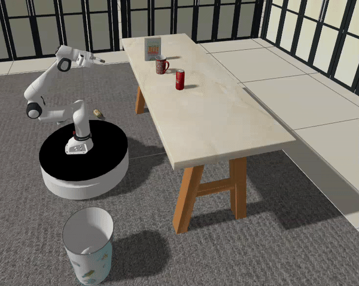

# Embodied-RobotSim: LLM-Driven Embodied Intelligence & Mobile Manipulation Simulation

[](https://docs.ros.org/en/jazzy/index.html)
[](https://docs.isaacsim.omniverse.nvidia.com/6.1.0/)
[](README.md)

Embodied-RobotSim is a ROS 2 (Jazzy) simulation workspace for a differential-drive mobile robot with a **Franka FR3 arm**, lidar and RGB-D sensors. Isaac Sim uses a roof-mounted MID-360 approximation and FAST-LIO localization pipeline. The project integrates mapping, navigation, perception, mobile manipulation and a **Qwen3 LLM-driven embodied intelligence loop**, with natural-language commands and a Web UI.

## 🎬 Demos

### 1. Large Language Model Embodied Closed-Loop (LLM Agent)


*Multi-modal interaction loop via Qwen3 and VLM*

### 2. Autonomous Mobile Grasping (Pick & Place)


*Autonomous Grasping via YOLOE & GraspNet*

### 3. Simulation Environment (Isaac Sim)

*Indoor simulation in Isaac Sim 6.1 with Nav2, MoveIt 2, and perception stacks*

## 🌟 Key Features

* **Isaac Sim Backend:** Import the robot from Xacro and connect ROS 2 topics and controller interfaces.
* **Mobile Manipulation:** Integration of MoveIt 2 for the Franka FR3 arm with a four-wheel differential-drive mobile base controller.
* **Exploration & Mapping:** MID-360 + FAST-LIO mapping and seeded ICP map localization, with `m-explore-ros2` frontier exploration.
* **Advanced Perception (Vision):**
  * **YOLOE Inference:** Real-time object detection with text prompts (`yoloe_infer`).
* **Semantic Occupancy & Grasping:**
  * Generates semantic occupancy mapping using OctoMap.
  * **Autonomous Grasping Integration:** Combines **YOLOE** (target localization) and **GraspNet** (pose estimation) to produce 6-DoF grasp poses from point clouds for arbitrary objects, with complex collision avoidance at both point cloud and OctoMap levels.
* **Embodied Intelligence & Multi-modal LLM Interaction:**
  * **Qwen3 LLM Engine:** Integrates the Qwen3 large language model, capable of parsing natural language instructions into robotic task sequences (navigation, grasping, etc.).
  * **Scene Pre-recognition:** Utilizes Vision-Language Models (VLM) to automatically "look at" the current environment before executing tasks, dynamically adjusting and planning subsequent operations.
  * **WebSocket-based Full-featured Web UI:** Provides an intuitive and beautiful browser-based control dashboard (including maps, camera streams, teleop joystick, status display, and an AI chat sidebar), completely eliminating the need for complex terminal operations.

## 📦 Architecture Overview

### ROS 2 Packages

| Package | Purpose |
|---------|---------|
| `x_bot` | Main robot package: URDF, Isaac Sim backend, scenes, launch files, navigation configs, and the `robot_actions` MoveIt arm controller. |
| `yoloe_infer` | TensorRT-based YOLOE object detection with text prompts. |
| `graspnet_infer` | TensorRT-based GraspNet integration for 6-DoF grasp pose generation from point clouds. |
| `m-explore-ros2` | `explore_lite` package adapted for ROS 2 to perform autonomous frontier-based exploration. |
| `franka_description` | Franka FR3 arm URDF and robot meshes. |
| `franka_ros2` | MoveIt 2 configs for the FR3 arm (`franka_fr3_moveit_config`). |

## 🛠️ System Requirements

To ensure the simulation system runs correctly, please deploy in the following environment:

| Dependency | Recommended Version |
|---------|---------|
| **Operating System** | [Ubuntu 24.04 (Noble)](https://ubuntu.com/download/desktop) |
| **ROS 2** | [Jazzy Jalisco](https://docs.ros.org/en/jazzy/installation.html) ([One-click Install](https://fishros.org.cn/forum/topic/20)) |
| **Isaac Sim** | 6.1 with ROS 2 Bridge, URDF Importer, experimental physics sensors and ros2_control extensions |
| **CUDA** | [13.1](https://developer.nvidia.com/cuda-toolkit) |
| **TensorRT** | [10.14.1.48](https://developer.nvidia.com/tensorrt) |
| **Python** | 3.12+ |

> **💻 Tested Hardware Reference**
>
> This project runs smoothly on the following mid-range consumer hardware, making it accessible and easy to deploy:
> *   **CPU**: Intel Core i5-13400F
> *   **GPU**: NVIDIA GeForce RTX 4060
> *   **Memory**: 32GB RAM

## 📦 Models Download

Since the model files are quite large, please download the pre-trained weights from the following link and place them in the specified directories:

*   **Download Link**: [Google Drive Folder](https://drive.google.com/drive/folders/1gPPyvKqiYd7cg2vUyqucV1CjLTf6J0y2?usp=drive_link)

| File Name | Placement Path (Relative to Project Root) |
| :--- | :--- |
| `yoloe-v8l-text-prompt-multi_nc10_fp16.onnx` | `src/yoloe_infer/models/` |
| `graspnet.onnx` | `src/graspnet_infer/` |

> **Note**: `.trt` and `.engine` files are no longer provided. Generate them locally from the ONNX files using the instructions below.

## 🚀 Quick Start Instructions

> **IMPORTANT**: ROS 2 Jazzy is a common dependency. All simulation startup scripts use Isaac Sim 6.1. CUDA, TensorRT, and model files are still required for the complete perception and grasping pipeline.

### 1. Build the Workspace

```bash
cd /path/to/Embodied-RobotSim
# 1. Build TensorRT Plugins (required for GraspNet)
bash src/graspnet_infer/tensorrt_plugins/build.sh

# 2. Install dependencies (rosdep + additional system packages)
rosdep update
rosdep install --from-paths src --ignore-src -r -y
sudo apt install ros-jazzy-moveit-ros-perception

# 3. Build all ROS 2 packages
colcon build --symlink-install --cmake-args -DCMAKE_BUILD_TYPE=Release
source install/setup.bash
```

### 2. Isaac Sim 6.1: roof MID-360 + FAST-LIO

> **Validation boundary:** Target-machine ROS/C++ builds, stationary IMU/TF, Nav2 motion and consecutive frontier goals have been checked in Isaac Sim 6.1. Known-map ICP, complete scene coverage and full grasping/LLM workflows still require separate validation.

All five demo entry points use **Isaac Sim**, importing the shared Xacro with FR3, RGB-D, Nav2 and MoveIt.

#### Sensor and localization contracts

* The 65 × 65 × 60 mm, 0.265 kg sensor is fixed to the front of the chassis roof, away from the central FR3 mount. Default pose relative to `roof_link`: `xyz=[0.25,0,0.0875]`, `rpy=[0,0,0]`. Simulated IMU and optical origins are colocated; FAST-LIO uses identity extrinsics, not real-device calibration.
* **PhysX collision-geometry ray queries** approximate a nonrepeating pattern: 360° horizontal, -7° to 52° vertical, 0.1–40 m, 200,000 rays per simulated second, 10 Hz clouds. This is not an official Livox optical model or RTX material-return model. Intensity is constant, self hits are discarded, and the 40 m cutoff is simulation-specific.
* At each 200 Hz physics step, 1,000 rays are sampled together, then accumulated over 100 ms. Per-point offsets preserve the actual sample instants at **5 ms resolution**; no artificial firing timestamps are assigned to an instantaneous cloud. Python ray queries may run substantially below real time.
* The physical IMU publishes specific force at 200 Hz (approximately +9.81 m/s² while stationary); world-truth orientation is not provided to FAST-LIO. Controller update rate is also 200 Hz.
* FAST-LIO provides local lidar-inertial odometry. **Known-map localization is a separate multiresolution ICP stage**, requiring a configured initial pose or RViz “2D Pose Estimate”. This is not blind global localization. Mapping has no loop-closure optimization.

| Output / TF | Owner |
|---|---|
| `/x_bot/mid360/points` | Isaac standard PointCloud2: xyz, intensity, offset_time(ns), line, tag |
| `/livox/lidar` / `/livox/imu` | External Livox CustomMsg converter / Isaac physical IMU |
| `/odom`, `/x_bot/odom`, `odom → base_footprint` | FAST-LIO adapter with IMU-to-base extrinsics |
| `map → odom` | Configured origin during mapping; ICP registration during localization |
| `/map` / `/x_bot/scan` | 5 cm ray-cleared occupancy grid / 2-D scan derived from deskewed 3-D points |
| `/localization/ready` / `/localization/status` | Readiness / registration quality and failure reasons |
| `/debug/ground_truth/odom` | Debug only: no navigation TF or estimator input |

Native FAST-LIO `camera_init/body` TF is remapped to a private topic. robot_state_publisher owns internal robot transforms. Commands retain `/x_bot/cmd_vel` and pass through a health gate to `/x_bot/cmd_vel_safe`. Invalid localization, stale data or time rewind stop the base; a simulator-side watchdog also checks command timeout. Limits: 2 m/s forward, 0.2 m/s reverse, 1 rad/s yaw. The gate does not cancel an already executing arm trajectory.

#### Target-machine installation

**Isaac base stability:** A single articulation controller writes all four wheel targets. Simulated IMU yaw-rate PI feedback compensates for four-wheel skid. Coupled simulation-time ramps limit target linear/angular acceleration to 1 m/s² and 1 rad/s². Zero, invalid and expired commands stop immediately and clear the integral, while intentional in-place turns remain supported. Compare `/x_bot/cmd_vel`, `/x_bot/cmd_vel_safe`, `/odom` and wheel joint velocities when debugging.

Use Ubuntu 24.04, ROS 2 Jazzy, and Isaac Sim 6.1 with ROS 2 Bridge, URDF Importer, experimental physics sensors and ros2_control extensions. No Livox hardware SDK is needed.

```bash
source /opt/ros/jazzy/setup.bash
# Install python3-vcstool, rosdep and the project's existing dependencies first.
bash scripts/setup_isaac_dependencies.sh
rosdep install --from-paths src --ignore-src -r -y
colcon build --symlink-install --cmake-args -DCMAKE_BUILD_TYPE=Release
source install/setup.bash
export ISAAC_SIM_PATH=/path/to/isaac-sim
# Alternatively: export ISAAC_SIM_PYTHON=/path/to/isaac-sim/python.sh
```

The [dependency manifest](dependencies/isaac.repos) pins FAST_LIO_ROS2 and the setup script recursively initializes its submodules. The [Livox message subset](src/isaac_livox_interfaces/README.md) pins upstream interface definitions, without the hardware driver. Do not add a second package named `livox_ros_driver2` to this workspace. Embedded Isaac Python publishes standard messages only; system ROS Python handles custom-message conversion.

#### Map first, then localize

```bash
# Main simple_room mapping defaults to maps/gazebo_simple_room; saving refuses to overwrite an existing bundle.
./start_explore_and_mapping.sh

# Another terminal, after exploring the required area:
source install/setup.bash
ros2 service call /localization/save_map std_srvs/srv/Trigger '{}'

# Navigation uses the same main simple_room and map directory.
# Stop the mapping session, then localize in the saved map:
./start_navigation.sh
```

A bundle contains `map.pcd`, `map.pgm`, `map.yaml` and `bundle.json`. The grid retains unobserved cells as unknown and clears free cells along measured rays; empty space is not assumed traversable. All files share the configured map origin. A 2-D YAML/PGM map or `isaac_simple_room.yaml` alone **cannot** supply this localization pipeline. No fabricated “validated PCD map” is shipped.

`INITIAL_X/Y/YAW` at the top of each script is the prior **base_footprint pose in map** (yaw in radians), not the IMU pose and not a ground-truth subscription. Exploration defaults to yaw=1.5708 and navigation to yaw=0, matching their respective example spawn headings. Edit the script defaults when changing spawn or map, or reset it in the RViz window.

| Entry point | Mode / scene |
|---|---|
| `start_explore_and_mapping.sh` | Automatic exploration / main simple_room |
| `start_pick_and_place_demo.sh` | Mapping-based pose + grasping / main manipulation_test |
| `start_navigation.sh` | Known-map localization / simple_room (main room layout) |
| `start_navigation_and_pick_demo.sh` | Localization + grasping / simple_room (main room layout) |
| `start_llm_agent.sh` | Localization + LLM / simple_room (main room layout) |

Run each script directly without arguments. Edit `WORLD`, `MAP_BUNDLE`, `INITIAL_X/Y/YAW`, `HEADLESS`, and `BUILD` at the top of each entry point; exploration also has `AUTO_EXPLORE`. Exploration uses `maps/gazebo_simple_room`, standalone grasping uses `maps/manipulation_test`, and navigation modes use `maps/gazebo_simple_room`. As in main, navigation requires an existing map and exits when it is missing. Exploration, navigation and grasping build by default; LLM builds on demand. Navigation uses ICP localization. Navigation/tasks wait for readiness, with a 180-second startup timeout. Five consecutive ICP failures require a new initial pose. Localization loss stops the base. Pause stops motion; after a simulation-clock reset, restart FAST-LIO, adapters and navigation rather than reusing estimator state. Startup runs `stop_robot_sim.sh`, closes marked service terminals, clears previous ROS/simulation processes and deletes ROS logs.

Isaac navigation targets **2 m/s in simulation time** on straight paths. Nav2 smoothing, the localization safety gate, and the base drive share this forward limit, with 1 m/s² acceleration and 2 m/s² deceleration. Turns, obstacles and goal approach still reduce speed. Observed wall-time speed also depends on the real-time factor; changing the speed limit does not make the simulator run in real time.


On this machine in Office, the original Python per-ray implementation measured about 0.20 real-time factor versus about 0.51 with native C++ batched raycasting (roughly 2.5x). Physics, wheel control and IMU remain at 200 Hz; lidar retains 1000 rays per physics step, 10 Hz clouds, and real sample offsets of 0–95 ms. Rendering targets 30 Hz. GPU physics was incompatible with the current ros2_control CPU tensor interface, so physics remains on CPU. These results depend on view, path and process load and are still below real time. Set `HEADLESS=true` in an entry point to disable the additional observer viewport while keeping cameras and ROS perception active.

Exploration defaults to LSM stereo depth (`src/LSM_depth_infer`, ROS package `stereo_matching`). OctoMap consumes `/x_bot/camera_left/nn_pointcloud` and YOLOE consumes `/x_bot/camera_left/nn_depth`; FAST-LIO and `/map` still use MID360. The entry script exposes depth source, base YAML, ROS parameter overrides and downstream topic names. Configure the engine/calibration/topics in `config/config.yaml` and depth/filter overrides in `config/isaac_params.yaml`, then restart. See [LSM configuration](src/LSM_depth_infer/README.md).

The localization RViz window displays the orange global `/plan` and cyan controller `/received_global_plan` once a navigation goal produces a path. Manual velocity commands on `/cmd_vel` or `/x_bot/cmd_vel` take priority over navigation. After 0.5 seconds without manual input, the base stops; navigation resumes 2 seconds after the last manual command. Both inputs stop when localization is not ready. Automatic commands pass through obstacle-approach slowdown before the localization safety gate publishes `/x_bot/cmd_vel_safe`.

Read-only telemetry using system ROS Python:
```bash
source /opt/ros/jazzy/setup.bash
python3 scripts/measure_isaac_performance.py --seconds 30 --output /tmp/isaac_performance.json
```
This reports real-time factor, sensor message rates per simulation second, commands, and actual travel speed. `ISAAC_PROFILE_SECONDS=20 ./start_explore_and_mapping.sh` writes `/tmp/isaac_performance_profile.txt`; profiling adds overhead, so disable it for speed measurements. The internal runtime accepts `--lidar-backend python` for reference comparisons. See the [NVIDIA performance handbook](https://docs.isaacsim.omniverse.nvidia.com/latest/reference_material/sim_performance_optimization_handbook.html).

Isaac chassis/roof visuals and colliders share 96-segment circular rings. The chassis radius is 0.35 m and the stowed-arm collision envelope is about 0.369 m; Both Nav2 costmaps use a 0.42 m safety radius plus 0.01 m footprint padding, retaining about 6 cm of radial clearance. RViz displays the planning footprint in green under `Navigation Safety Footprint`. Since `/x_bot/scan` is a height-filtered 2D virtual scan, the 4 cm local costmap uses only current scan obstacles and inflation; historical `/map` occupancy remains in the global planner, preventing stale static cells from overwriting local clearing. Unobserved scan directions are not treated as free rays.

Existing navigation-and-pick/LLM tasks include hardcoded map goals: review them after changing maps/origins. Localization readiness does not establish that a task goal is valid for the new map.

Root entry points match main; shared startup lives in `scripts/robot_services.sh` and the Isaac runtime in `scripts/isaac_runtime.sh`. Office has ambient fill and eight ceiling lights. Download scenes and main-branch grasp objects once:
```bash
~/isaacsim/python.sh scripts/download_isaac_environments.py
```

The original main-branch Gazebo worlds are converted into `~/isaacsim_assets/6.1/GazeboMain`, alongside source assets and licences. Their first launch converts missing assets automatically; to prepare all six worlds:
```bash
~/isaacsim/python.sh scripts/migrate_gazebo_scenes.py
```
Supported original worlds: `simple_room` (compatible aliases `legacy_room` or `gazebo_simple_room`), `manipulation_test`, `small_house`, `ware_house`, `obstacle_avoidance_test`, and `empty`. `WORLD=simple_room` selects main's original room; NVIDIA's official Simple Room uses `isaac_simple_room`. Conversion preserves meshes, UVs/textures, COLLADA units/node matrices, and hierarchical SDF poses/scales, with separate visual and collision geometry. PhysX uses convex decomposition for dynamic mesh colliders, and lights use USD intensity units; contact dynamics and rendering differ from Gazebo.

Standalone grasping defaults to main's original manipulation test. Navigation in the restored room uses `maps/gazebo_simple_room`; rebuild the map in the restored geometry. Exploration now defaults to `WORLD=simple_room` and `MAP_BUNDLE="$ROOT_DIR/maps/gazebo_simple_room"`; launch, explore and save, then navigate. Office remains available by editing the script defaults.

Check transforms and asset references and render reference views into `docs/validation/gazebo_scene_migration`:
```bash
~/isaacsim/python.sh scripts/validate_gazebo_scene_assets.py
```

Dynamic mesh decomposition uses shrink-wrap and a lower approximation error to prevent an inflated tabletop from making objects float. Run actual physics for four seconds and compare object bottoms against the visible tabletop:
```bash
~/isaacsim/python.sh scripts/validate_gazebo_scene_contacts.py
~/isaacsim/python.sh scripts/validate_gazebo_scene_contacts.py --world simple_room
```
Assets default to `~/isaacsim_assets/6.1`, overridden by `ISAAC_ASSETS_PATH`.

Low-level debugging, in separate terminals:
```bash
bash scripts/isaac_runtime.sh
ros2 launch x_bot isaac_controllers.launch.py
ros2 launch x_bot_localization localization.launch.py mode:=mapping bundle:=/absolute/path/new_map
```
`--publish-odom-tf` was removed; simulation truth must not fill navigation TF gaps. When customizing the mount, keep simulator `--mid360-xyz/--mid360-rpy` identical to controller-launch `mid360_xyz/mid360_rpy`. Colocated lidar/IMU extrinsics remain identity.

#### Verification

Offline:
```bash
python3 -m unittest discover -s tests -v
```
Tests cover layout/endian handling, real sample offsets, reset handling, extrinsics/quaternions, occupancy clearing and unknown cells, health state, both Xacro backends, configs and syntax. NumPy and PyYAML are required; Xacro expansion is skipped if xacro is unavailable. The PCL synthetic registration test in `src/x_bot_localization/test` requires a target build:
```bash
colcon test --packages-select x_bot_localization
colcon test-result --verbose
ros2 topic hz /livox/imu
ros2 topic hz /livox/lidar
ros2 topic echo /localization/ready
ros2 topic echo /localization/status
ros2 run tf2_ros tf2_echo map base_footprint
ros2 control list_controllers
```

Target acceptance must additionally check gravity direction, common sensor timebase, 200/10 Hz in simulation time, turning deskew, sensor/arm occlusion, unique TF authorities, save/reload, rejection of bad priors, stopping on localization/data loss, and Nav2/grasping regressions. Camera and arm interfaces remain unchanged.

References: [FAST-LIO ROS2](https://github.com/Ericsii/FAST_LIO_ROS2), [Livox message definitions](https://github.com/Livox-SDK/livox_ros_driver2/tree/21445540f0d100dc86a7e6df312dd70bbdb4afdf/msg), [NVIDIA PhysX scene queries](https://docs.omniverse.nvidia.com/kit/docs/omni_physics/108.1/extensions/runtime/source/omni.physx/docs/dev_guide/scene_queries.html).

### 3. Generate TensorRT Engine Files

TensorRT engine files are tied to your specific GPU and TensorRT version. They cannot be shared across devices and must be regenerated locally:

```bash
# YOLOE object detection model
trtexec --onnx=src/yoloe_infer/models/yoloe-v8l-text-prompt-multi_nc10_fp16.onnx \
  --saveEngine=src/yoloe_infer/models/yoloe-v8l-text-prompt-multi_nc10_fp16.engine

# GraspNet grasping model (requires the FPS plugin built in the workspace-build section)
trtexec --onnx=src/graspnet_infer/graspnet.onnx \
  --saveEngine=src/graspnet_infer/graspnet.trt \
  --staticPlugins=src/graspnet_infer/tensorrt_plugins/build/libfps_plugin.so
```

### 4. Run the Demos

All five one-click scripts start Isaac Sim without arguments. Exploration starts automatically; navigation, mobile manipulation and LLM modes use maps/gazebo_simple_room if present and exit with a map prerequisite message otherwise.

#### Mode 1: Autonomous Exploration & Mapping
Wait for localization and active Nav2 servers, then explore automatically using MID-360, FAST-LIO, Nav2 and `explore_lite`, with YOLOE/OctoMap:
```bash
./start_explore_and_mapping.sh
```

#### Mode 2: Static Navigation
Navigate with Nav2, FAST-LIO and seeded ICP localization against a saved map bundle:
```bash
./start_navigation.sh
```

#### Mode 3: Autonomous Mobile Grasping (Pick and Place)
Spawn the robot in the `manipulation_test` world, start perception pipelines (YOLOE, GraspNet), and execute a semantic pick-and-place loop using MoveIt! (for example: identifying, grabbing, and placing a coke, a book, and a cup):
```bash
./start_pick_and_place_demo.sh
```

#### Mode 4: Navigation and Pick

Run Nav2, MoveIt 2, and the complete perception/grasping stack in `legacy_room` (main room layout and task coordinates) to execute the mobile workflow “navigate to the kitchen → detect and grasp → return”:

```bash
./start_navigation_and_pick_demo.sh
```

#### Mode 5: Large Language Model Embodied Closed-Loop (LLM Agent + Web UI)
> ⚠️ **Preparation before running**: This mode depends on the Qwen Large Language Model service provided by the Alibaba Cloud Bailian platform.
> 1. Please go to the [Alibaba Cloud Bailian Platform](https://www.aliyun.com/product/bailian) to register/login, and create your **API Key** on the "API-KEY Management" page.
> 2. Before running the startup script, you must export this API Key as an environment variable in your **current terminal**:
>    ```bash
>    export DASHSCOPE_API_KEY="your_DASHSCOPE_API_KEY"
>    ```

This mode launches the full suite of low-level control and perception nodes, mounts the Qwen3 LLM Agent server, and finally opens the Web UI dashboard automatically in your browser. You can directly input natural language commands in the chat sidebar (e.g., "Go to the kitchen to get a coke", "Get a book from the study"), and the system will automatically recognize the scene and plan the execution:
```bash
./start_llm_agent.sh
```

> **Note:** To quickly kill all related simulation and ROS 2 processes, use the helper script:  
> `./stop_robot_sim.sh`

## ⚙️ Key Topics and Services

* **/arm_command/pose** (Topic, `geometry_msgs/msg/PoseStamped`): Move the Franka arm to the desired pose.
* **/robot_actions/go_home** (Service, `std_srvs/srv/Trigger`): Move the arm to its home standby position.
* **/robot_actions/scan** (Service, `std_srvs/srv/Trigger`): Move the arm to its scanning pose for optimal camera coverage.
* **/yoloe_multi_text_prompt/set_cloud_filter** (Topic, `std_msgs/msg/Int32`): Sets the target ID for point cloud filtering based on semantic detections.

## 🤝 Contribution and Customization

* **World Environments:** Scene structure files are in `src/x_bot/worlds/`; Isaac procedural USD scenes are authored in `src/x_bot/isaac_sim/scene_builder.py`.
* **Navigation Config:** Tune Isaac Nav2 and FAST-LIO parameters in `src/x_bot_localization/config/`.
## 👏 Acknowledgements

This project is built upon the following open-source repositories. We sincerely thank the authors and maintainers for their contributions:

* **[YOLOE](https://github.com/THU-MIG/yoloe):** Robust 2D object detection framework.
* **[GraspNet-Baseline](https://github.com/graspnet/graspnet-baseline):** Foundation for 6-DoF grasp pose estimation.
* **[m-explore-ros2](https://github.com/robo-friends/m-explore-ros2):** Autonomous exploration components for ROS 2.
* **[franka_ros2](https://github.com/frankaemika/franka_ros2) & [franka_description](https://github.com/frankaemika/franka_description):** Official ROS 2 support from Franka Emika.
* **[FAST-LIO](https://github.com/hku-mars/FAST_LIO):** LiDAR-inertial odometry and mapping.
* **[bcr_bot](https://github.com/blackcoffeerobotics/bcr_bot):** Reference for differential drive mobile base simulation.
